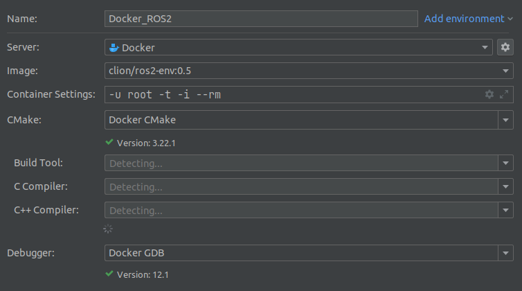

# About

Reference Dockerfile to get started with Docker or Remote toolchain in CLion. 

Read more in CLion [Blog](https://blog.jetbrains.com/clion/2020/01/using-docker-with-clion/#major-updates)

# ROS2
## `Dockerfile.ros2`
Summary 
- Docker image + container
- Auto-Completing + Code hints
- Debugging + Executing

[Test environment](https://github.com/SiyuChen1/ros2_iron_ws.git)
#### Toolchain
In CLion `Build, Execution, Deployment | Toolchains` choose `Docker`. 

Pay attention to:
- Container Settings
  - `-u root` change to root user. Why? Answer: See [here](https://answers.ros.org/question/399311/ros2-through-docker-failed-to-configure-logging-failed-to-create-log-directory/).
  - `-i` runs docker container in interactive mode, which is essential to get the ros environment variables. Without `-i`, even entrypoint is set explictly or `source /opt/ros/$ROS_DISTRO/setup.bash` is added to `.bashrc`.

#### CMake Set up:

Environment doesn't need to be manuelly set up.

## `Dockerfile.ros2-docker-ssh-env`
Summary
- Docker image + container + ssh
- Auto-Completing + Code hints

[Test environment](https://github.com/SiyuChen1/ros2_iron_ws.git)
#### Toolchain
In CLion `Build, Execution, Deployment | Toolchains` choose `Remote Host`.

#### CMake Set up:

Pay attention to:
- Environment variables have to be set manuelly. They can be get using a script.

## `Dockerfile.ros2-docker-ssh-sourced-env`
Summary
- Docker image + container + ssh
- Auto-Completing + Code hints
- Debugging + Executing

[Test environment](https://github.com/SiyuChen1/ros2_iron_ws.git)
#### Toolchain
In CLion `Build, Execution, Deployment | Toolchains` choose `Remote Host`.

#### CMake Set up:

Pay attention to:
- Environment variables don't need to be set.

# ROS1
## `Dockerfile.ros-noetic-yaml-docker-ssh-env`
Summary
- Docker image + container
- yaml-cpp as third party library
- Auto-Completing + Code hints

Same as ROS2

## `Dockerfile.ros-noetic-yaml-docker-ssh-sourced-env`
Summary
- Docker image + container
- yaml-cpp as third party library
- Auto-Completing + Code hints
- Debugging + Executing

Same as ROS2

## Python
An additional python interpreter path must be added.
